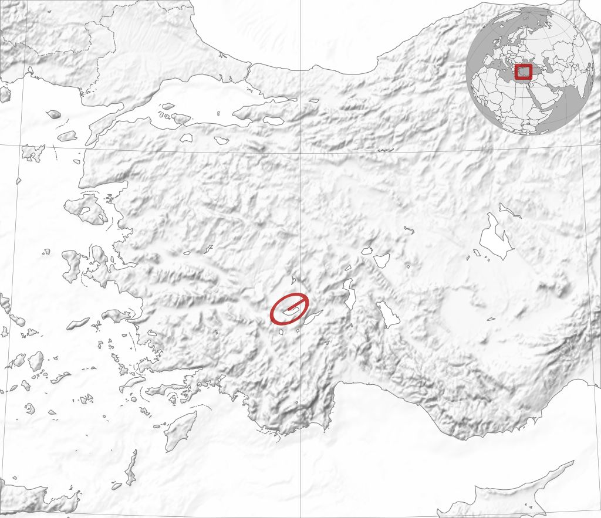
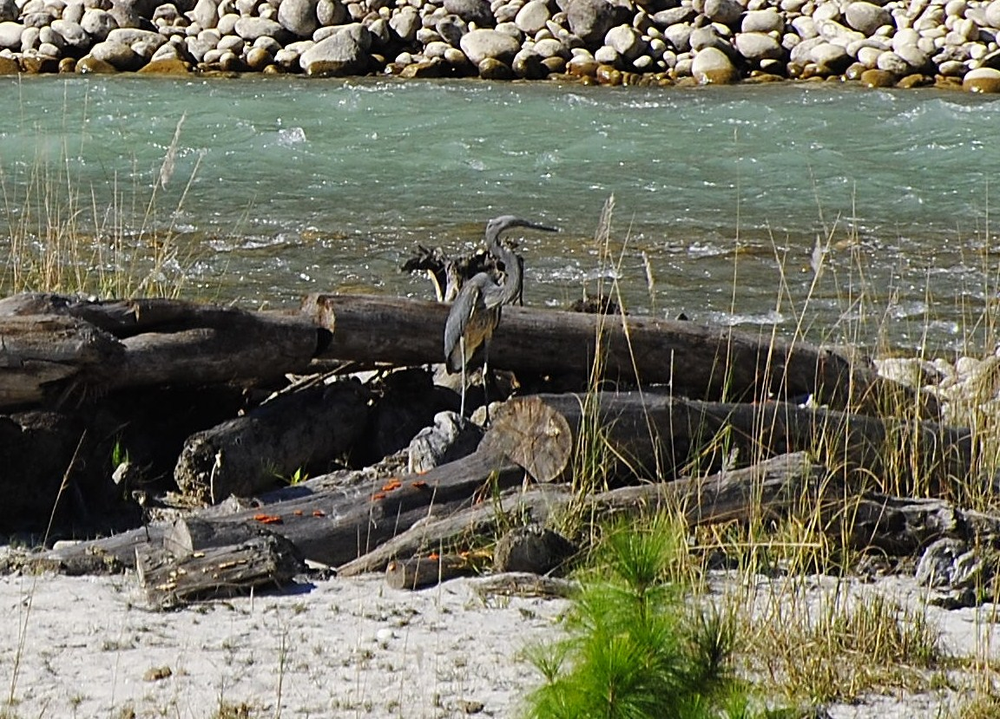
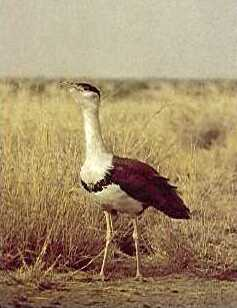
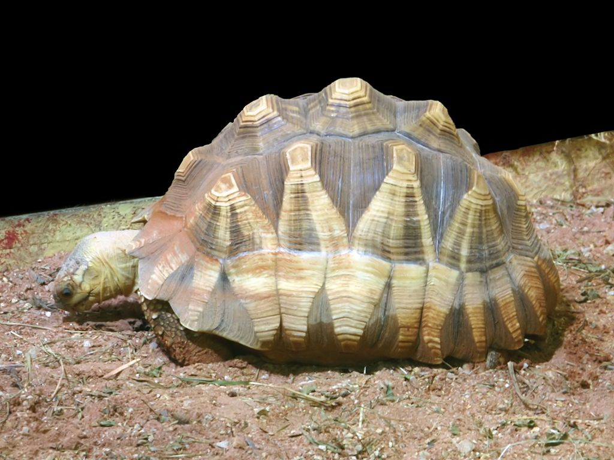

# Tables in Markdown

When writing documentation in Markdown using Sphinx and MyST-Parser you can use the standard Markdown syntax or MyST-Parser directives `table`, `csv-table` and `list-table`.

## Standard syntax

MyST-Parser supports the usual table syntax of the standard Github Flavoured Markdown. It is the simplest and more readable table syntax in Markdown:

``````markdown
| Header One   | Header Two     | Header Three    |
| ------------ | -------------- | --------------- |
| Nulla 1      | Lacus 2        | Hendrerit 3     |
| Dignissim 11 | Morbi 12       | Pellentesque 13 |
| Donec sit 21 | Ullamcorper 22 | Quis 23         |
| Phasellus 31 | Ante 32        | Tempus 33       |
``````

| Header One   | Header Two     | Header Three    |
| ------------ | -------------- | --------------- |
| Nulla 1      | Lacus 2        | Hendrerit 3     |
| Dignissim 11 | Morbi 12       | Pellentesque 13 |
| Donec sit 21 | Ullamcorper 22 | Quis 23         |
| Phasellus 31 | Ante 32        | Tempus 33       |

### Column alignment

Cells in a column can be aligned using the colon character (`:`):

 * Align to the **left** by adding a `:` to the beggining of the hyphens.
 * Align to the **center** by adding a `:` to the beggining and to the end of the hyphens.
 * Align to the **right** by adding a `:` to the end of the hyphens.

An example table with alignment:

``````markdown
| Header One   | Header Two     | Header Three    |
| :----------- | :------------: | --------------: |
| Nulla 1      | Lacus 2        | Hendrerit 3     |
| Dignissim 11 | Morbi 12       | Pellentesque 13 |
| Donec sit 21 | Ullamcorper 22 | Quis 23         |
| Phasellus 31 | Ante 32        | Tempus 33       |
``````

| Header One   | Header Two     | Header Three    |
| :----------- | :------------: | --------------: |
| Nulla 1      | Lacus 2        | Hendrerit 3     |
| Dignissim 11 | Morbi 12       | Pellentesque 13 |
| Donec sit 21 | Ullamcorper 22 | Quis 23         |
| Phasellus 31 | Ante 32        | Tempus 33       |


## `table` directive

MyST-Parser's [table directive](https://myst-parser.readthedocs.io/en/latest/syntax/tables.html#table-with-captions) provides more style customization and can be used to create tables with caption:

``````markdown
:::{table} Table caption
:width: 65
:widths: auto
:align: center

| Header One   | Header Two     | Header Three    |
| :----------- | :------------: | --------------: |
| Nulla 1      | Lacus 2        | Hendrerit 3     |
| Dignissim 11 | Morbi 12       | Pellentesque 13 |
| Donec sit 21 | Ullamcorper 22 | Quis 23         |
| Phasellus 31 | Ante 32        | Tempus 33       |
:::
``````

:::{table} Table caption
:width: 65%
:widths: auto
:align: center

| Header One   | Header Two     | Header Three    |
| :----------- | :------------: | --------------: |
| Nulla 1      | Lacus 2        | Hendrerit 3     |
| Dignissim 11 | Morbi 12       | Pellentesque 13 |
| Donec sit 21 | Ullamcorper 22 | Quis 23         |
| Phasellus 31 | Ante 32        | Tempus 33       |
:::

## `csv-table` directive

The `csv-table` directive creates a table from Comma-Separated-Values data. See the complete documentation of the [csv-table directive](https://myst-parser.readthedocs.io/en/latest/syntax/tables.html#csv-tables) in the MyST-Parser docs. Here is an example based on the data from the previous table:

``````markdown
:::{csv-table} Table caption
:header: >
:   "Header One", "Header Two", "Header Three"
:width: 65%
:widths: auto
:align: center

"Nulla 1", "Lacus 2", "Hendrerit 3"
"Dignissim 11", "Morbi 12", "Pellentesque 13"
"Donec sit 21", "Ullamcorper 22", "Quis 23"
"Phasellus 31", "Ante 32", "Tempus 33"
:::
``````

:::{csv-table} Table caption
:header: >
:   "Header One", "Header Two", "Header Three"
:width: 65%
:widths: auto
:align: center

"Nulla 1", "Lacus 2", "Hendrerit 3"
"Dignissim 11", "Morbi 12", "Pellentesque 13"
"Donec sit 21", "Ullamcorper 22", "Quis 23"
"Phasellus 31", "Ante 32", "Tempus 33"
:::

## `list-table` directive

The `list-table` directive ([MyST-Parser docs on list-table](https://myst-parser.readthedocs.io/en/latest/syntax/tables.html#list-tables)) is used to create a table from data in a uniform two-level bullet list. “Uniform” means that each sublist (second-level list) must contain the same number of list items.

Here below is an example of a list-table:

``````markdown
:::{list-table} Board games
:widths: 20 15 65
:header-rows: 1

*   - Name
    - Number of players
    - Description
*   - Catan
    - 3 to 4
    - Players take on the roles of settlers, each attempting to build and
     develop holdings while trading and acquiring resources. Players gain
     victory points as their settlements grow and the first to reach a set
     number of victory points, typically 10, wins.
*   - Ticket to Ride
    - 2 to 5
    - Players collect and play train car cards to claim train routes across the
     map. Points are earned based on the length of the claimed routes, whoever
     completes the longest continuous railway, and whether the player can
     connect distant cities which are determined by drawing ticket cards.
*   - Chess
    - 2
    - An abstract strategy game that involves no hidden information and no
     elements of chance. Today, chess is one of the world's most popular games
     played by millions of people worldwide.
:::
``````

:::{list-table} Board games
:widths: 20 15 65
:header-rows: 1

*   - Name
    - Number of players
    - Description
*   - Catan
    - 3 to 4
    - Players take on the roles of settlers, each attempting to build and
     develop holdings while trading and acquiring resources. Players gain
     victory points as their settlements grow and the first to reach a set
     number of victory points, typically 10, wins.
*   - Ticket to Ride
    - 2 to 5
    - Players collect and play train car cards to claim train routes across the
     map. Points are earned based on the length of the claimed routes, whoever
     completes the longest continuous railway, and whether the player can
     connect distant cities which are determined by drawing ticket cards.
*   - Chess
    - 2
    - An abstract strategy game that involves no hidden information and no
     elements of chance. Today, chess is one of the world's most popular games
     played by millions of people worldwide.
:::

(a-wide-table-in-markdown)=
## A wide table example

This is an extract of the first 10 rows of the table of the World's 100 most threatened species, [taken from Wikipedia](https://en.wikipedia.org/wiki/The_world%27s_100_most_threatened_species).

The width of the table is wider than the width of the central column. When a table exceeds the width of the central column, Nefertiti for Sphinx displays a link at the right side of the caption of the table, that on click will display a modal window with the content of the table.

:::{list-table} The World's 100 most threatened species
:widths: 170 120 120 240 220 180 250
:header-rows: 1

*   - Species
    - Common name
    - Type
    - Image
    - Location(s)
    - Estimated population
    - Threats
*   - [Abies beshanzuensis](https://en.wikipedia.org/wiki/Abies_beshanzuensis)
    - Baishan fir
    - Plant (Tree)
    - ```{image} img/Abies_beshanzuensis_distribution_map.jpg
      ```
    - Baishanzu Mountain, Zhejiang, China
    - Three mature individuals
    -   * agriculture
        * fire
*   - [Actinote zikani](https://en.wikipedia.org/wiki/Actinote_zikani)
    -
    - Insect (butterfly)
    - ```{image} img/250px-AC83_Actinote_zikani_(49807063187).jpg
      ```
    - Near São Paulo, Atlantic forest, Brazil
    - Unknown
    -   * habitat loss from human expansion
*   - [Aipysurus foliosquama](https://en.wikipedia.org/wiki/Aipysurus_foliosquama)
    - Leaf scaled sea-snake
    - Reptile
    - ```{image} img/330px-Aipysurus_foliosquama_(WAM_R150365)_from_Barrow_Island.jpg
      ```
    - Ashmore Reef and Hibernia Reef, Timor Sea
    - Unknown
    -   * unknown—probably degradation of coral reef habitat
*   - [Amanipodagrion gilliesi](https://en.wikipedia.org/wiki/Amanipodagrion_gilliesi)
    - Amani flatwing
    - Insect (damselfly)
    - ```{image} img/Amanipodagrion_gilliesi_distribution_map.jpg
      ````
    - Amani-Sigi Forest, Usamabara Mountains, Tanzania
    - < 500 individuals
    -   * population pressure and water pollution
*   - [Antisolabis seychellensis](https://en.wikipedia.org/wiki/Antisolabis_seychellensis)
    -
    - Insect
    - ```{image} img/Anisolabis_seychellensis_distribution_map.jpg
      ```
    - Morne Blanc, Mahé island, Seychelles
    - Unknown
    -   * invasive species
        * climate change
*   - [Antilophia bokermanni](https://en.wikipedia.org/wiki/Antilophia_bokermanni)
    - Araripe manakin
    - Bird
    - _on_nest.jpg)
    - Chapado do Araripe, South Ceará, Brazil
    - 779 individuals
    -   * recreational facilities
        * water diversion
*   - [Aphanius transgrediens](https://en.wikipedia.org/wiki/Aphanius_transgrediens)
    - Aci Göl toothcarp
    - Fish
    - 
    - south-eastern shore of former Lake Aci, Turkey
    - few hundred pairs
    -   * competition and predation by [Gambusia](https://en.wikipedia.org/wiki/Gambusia)
        * road construction
*   - [Ardea insignis](https://en.wikipedia.org/wiki/Ardea_insignis)
    - White bellied heron
    - Bird
    - 
    - Bhutan, North East India and Myanmar
    - 70–400 individuals
    -   * hydropower development
*   - [Ardeotis nigriceps](https://en.wikipedia.org/wiki/Ardeotis_nigriceps)
    - Great Indian bustard
    - Bird
    - 
    - Rajasthan, Gujarat, Maharashtra, Andhra Pradesh, Karnataka and Madhya, India
    - 50–249 mature individuals
    -   * agricultural development
        * energy transmission lines
*   - [Astrochelys yniphora](https://en.wikipedia.org/wiki/Astrochelys_yniphora)
    - Ploughshare tortoise
    - Reptile
    - 
    - Baly Bay region, northwestern Madagascar
    - 440–770
    - illegal collection for international pet trade
:::
