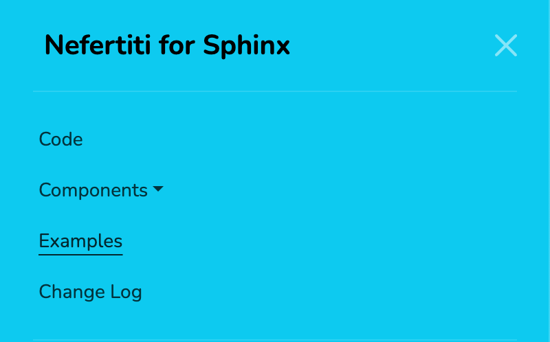

.. _header-links:

Header links
############

Nefertiti for Sphinx can display links in the header, either in the same row as the rest of the header elements, or if there were many links, in a second row below the main header.

In the first row
================

Having a few link items allows for displaying them in one row along with the rest of the elements in the header. In need for further customization, like increasing the font size of the links, you can always provide your own CSS file to overwrite the styling. The element holding the header links has the CSS class ``nftt-header-links-large``.

In the second row
=================

Displaying several links might not fit well in one line together with the rest of the items in the header. In such a case they can be displayed below the name of the project. In the example image the second item is a dropdown item. Dropdown items group header links together.

In narrow windows
=================

When resizing your browser window in your computer, or accessing a Sphinx site with a smaller device, like a phone or a tablet, the header resizes and hides the links under the menu in the right side of the header.

To further customize how the header links look like in a narrow window, you can provide your own CSS file and overwrite the CSS class ``nftt-header-links-small``.

Theme options
=============

The ``html_theme_options`` setting in Nefertiti for Sphinx can have two entries related with the display of header links:

#. The ``header_links`` entry is a list of Python dictionaries with the items to display.
#. The ``header_links_in_2nd_row`` entry is a boolean value.

1. ``header_links``
-------------------

Header links can be either actual links or dropdown elements. Each header link may contain a ``text``, a ``link``, an optional ``match`` and an optional ``target``:

* ``text``: a string.
* ``link``: a document path in Sphinx or a URL.
* ``match``: a string or list or strings, used as JavaScript Regular Expressions.
* ``target``: a string with any of the expected values for the `HTML anchor's target attribute <https://developer.mozilla.org/en-US/docs/Web/HTML/Reference/Elements/a#target>`_.

An example:

.. code-block:: python

    html_theme_options = {
        # ... other options ...
        "header_links": [
            {
                "text": "Examples",
                "link": "examples/index",
                "match": "/examples/*",
            },
        ],
    }

When the user visits the link given in a header-link, an underline indicates that the item is the active header-link.

If we want to display the underline with other URLs that do not match the URL given in the ``link``, pass the ``match`` key with a Regular Expression (or more than one) to indicate what URLs must activate the header-link.

Let's see it with some examples.

1.1. Simple header links
^^^^^^^^^^^^^^^^^^^^^^^^

    The header displays the three links next to the project's name.

The following ``header_links``, added to the ``html_theme_options`` setting of an example ``conf.py`` file, adds 3 links to the header:

* A link to the example home page,
* a link to the tutorial page, and
* a link to the blog.

.. code-block:: python

    'header_links': [
        {
            'text': 'Home',
            'link': 'index',
        },
        {
            'text': 'Tutorial',
            'link': 'tutorial',
        },
        {
            'text': 'Blog',
            'link': 'https://example.com/blog',
            'target': '_blank',
        },
    ],

The **Tutorial** link points to the URL ``/tutorial.html``. When the user clicks on it the URL loads and an underline appears below **Tutorial** to indicate that it is the current active link:

.. cs_figure:: img/rhythm-header-tutorial-active.*
    :alt: The header link "Tutorial" is active.
    :width: 500px
    :align: center
    :class: border-radius-2

    The location bar at ``/tutorial.html`` and the **Tutorial** link with an underline indicates that it is the active header link.

1.2. Header links with regexps
^^^^^^^^^^^^^^^^^^^^^^^^^^^^^^

It is possible to use Regular Expressions with header links. You could have a ``toctree`` in your Sphinx project that groups together documents in different paths, and you might want to have an entry in your header that displays as active, with an underline, when the document loaded belongs to that ``toctree``.

Imagine you have a ``toctree`` like:

.. code-block:: reStructuredText

    .. toctree::
        :maxdepth: 2
        :caption: Learn

        learn/index
        python-types
        async
        tutorial/index
        tutorial/first-steps.md
        tutorial/dependencies/index.md
        tutorial/metadata.md
        advanced/index.md

You could add an entry **Learn** to your header with a header link like:

.. code-block:: python

    'header_links': [
        # ... other header links ...
        {
            'text': 'Learn',
            'link': 'learn/index',
            'match': [
                '/learn/*',
                '/python-types.html',
                '/async.html',
                '/tutorial/*',
                '/tutorial/dependencies/*',
                '/advanced/*',
            ]
        },
    ],

Each entry in the ``match`` attribute is interpreted as a JavaScript Regular Expression.

The example presented is based on the **Learn** menu item of the FastAPI_ documentation website. In FastAPI's docs the **Learn** menu item groups together several URLs (see the original MkDocs configuration file `here <https://github.com/fastapi/fastapi/blob/master/docs/en/mkdocs.yml#L105>`_). You could get the same effect with the ``match`` attribute of the ``header_links``.

1.3. Header links with dropdowns
^^^^^^^^^^^^^^^^^^^^^^^^^^^^^^^^

If you wanted to reproduced the previous ``toctree`` as a dropdown menu in the header, you could rewrite the ``header_links`` as follow:

.. code-block:: python

    'header_links': [
        # ... other header links ...
        {
            "text": "Learn",
            "dropwdown": (
                {
                    "text": "Learn",
                    "link": "learn/index",
                }, {
                    "text": "Python Types Intro",
                    "link": "python-types",
                }, {
                    "text": "Concurrency and async/await",
                    "link": "async",
                }, {
                    "divider": True,
                }, {
                    "text": "Tutorial - User Guide",
                    "link": "tutorial/index",
                }, {
                    "text": "Advanced User Guide",
                    "link": "advanced/index",
                }
            )
        }
    ]

.. cs_figure:: img/rhythm-header-learn-dropdown.*
    :alt: A dropdown header link.
    :width: 500px
    :align: center
    :class: border-radius-2

    The example dropdown entry for "Learn" is a sequence of ``text`` and ``link``.

1.4. Header links with dropdowns and regexps
^^^^^^^^^^^^^^^^^^^^^^^^^^^^^^^^^^^^^^^^^^^^

Dropdowns can also include Regular Expressions by adding a ``match`` to the item inside the dropdown.

Following up on the previous example, if the tutorial had more documents, we would be able to paginate following the links at the bottom of the page. However, by doing so, the dropdown "Learn" would lose the active state, as the URL of the documents inside the tutorial would not match the ``"link": "tutorial/index"``:

.. cs_figure:: img/rhythm-header-learn-dropdown-loses-active.*
    :alt: The dropdown loses the active state.
    :width: 500px
    :align: center
    :class: border-radius-2

    The dropdown "Learn" lost the active state, as the URL ``/tutorial/body.html`` does not match any of the links in the ``header_link``.

Adding the following ``match`` to the Tutorial item inside the dropdown will have the effect of keeping the item selected and the link active:

.. code-block:: python

    'header_links': [
        # ... other header links ...
        {
            "text": "Learn",
            "dropwdown": (
                {
                    "text": "Learn",
                    "link": "learn/index",
                }, {
                    "text": "Python Types Intro",
                    "link": "python-types",
                }, {
                    "text": "Concurrency and async/await",
                    "link": "async",
                }, {
                    "divider": True,
                }, {
                    "text": "Tutorial - User Guide",
                    "link": "tutorial/index",
                    "match": "/tutorial/*",
                }, {
                    "text": "Advanced User Guide",
                    "link": "advanced/index",
                }
            )
        }
    ]

.. cs_figure:: img/rhythm-header-learn-dropdown-with-regexp.*
    :alt: The dropdown loses the active state.
    :width: 90%
    :align: center
    :class: border-radius-2

    The dropdown "Learn" is active when the user visits the URL ``/tutorial/body.html`` as it matches the regular expression given in the ``match``: ``^/tutorial/*``.

2. ``header_links_in_2nd_row``
------------------------------

To display links in the second row, below the name of the project, define the option ``"header_links_in_2nd_row": True`` in the ``html_theme_options``, in your project's ``conf.py`` module.

.. cs_figure:: img/rhythm-header-in-2-rows.*
    :alt: Header links can be displayed in the second row of the header.
    :width: 90%
    :align: center
    :class: border-radius-2

    Use ``"header_links_in_2nd_row": True`` to display the header links in the second row of the header.

Rebuild the theme
=================

With the previous changes in place, save the content, clean, build and serve your project again:

.. code-block:: shell

    $ make clean
    $ make html
    $ python -m http.server -d build/html

Visit http://localhost:8000 to take a look at the changes.

.. _FastAPI: https://fastapi.tiangolo.com/learn
