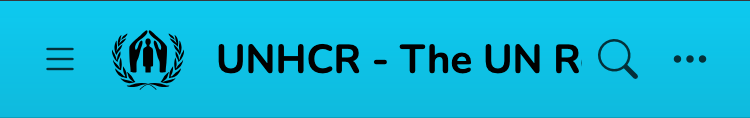

.. _theme-options:

Theme Options
#############

This is the list of customizable options available in Nefertiti for Sphinx. They go in the ``html_theme_options`` setting, in your project's ``conf.py`` file:

1. ``project_short``
2. ``style``
3. ``style_header_neutral``
4. ``pygments_light_style``
5. ``pygments_dark_style``
6. ``sans_serif_font``
7. ``monospace_font``
8. ``monospace_font_size``
9. ``project_name_font``
10. ``documentation_font``
11. ``documentation_font_size``
12. ``doc_headers_font``
13. ``locales``
14. ``logo``
15. ``logo_location``
16. ``logo_alt``
17. ``logo_height``
18. ``logo_url``
19. ``logo_width``
20. ``current_version``
21. ``versions``
22. ``repository_url``
23. ``repository_name``
24. ``header_links_in_2nd_row``
25. ``header_links``
26. ``footer_links``
27. ``show_powered_by``
28. ``show_colorset_choices``
29. ``reset_colorset_choice_after_ms``

1. ``project_short``
*************************

``project_short`` represents a shorter version of the ``project`` setting. It is used in the header as the name of the project when the site is rendered in a small device like a phone screen.

When not given the header displays the value given in the ``project`` setting.

.. code-block:: python

    project = "UNHCR - The UN Refugee Agency"


    The header displays the value of ``project`` in a wide enough header.



    In a small device the value of ``project`` is trimmed.


Adding the option ``project_short`` to the ``html_theme_options`` with a value like ``"UNHCR"`` will display the header without the need to scroll horizontally:

.. code-block:: python

    html_theme_options = {
        "project_short": "UNHCR",
    }

.. figure:: img/option-project_short.*
    :alt: Option "project_short".
    :width: 370px
    :align: center
    :class: border-radius-2

    The header after adding the option ``project_short``.


2. ``style``
************

``style`` may take any of the following values:

* ``blue``
* ``indigo``
* ``purple``
* ``pink``
* ``red``
* ``orange``
* ``yellow``
* ``green``
* ``tail``
* ``default``

When not given its value is ``default``, which corresponds to **cyan**. It allows to customize the primary color of the theme.

.. code-block:: python

    html_theme_options = {
        "style": "green",
    }

Read more about it in :ref:`Customization > Colorsets <colorsets>`.


3. ``style_header_neutral``
***************************

``style_header_neutral`` may be ``True`` or ``False``.

When it is ``True`` the header adapts the primary color to the user's preferred color scheme. If it is ``False`` the header does not change between dark and light appearance. It is ``False`` by default.

.. code-block:: python

    html_theme_options = {
        "style_header_neutral": True,
    }

Read more about it in :ref:`Customization > Colorsets <colorsets>`.


4. ``pygments_light_style``
***************************

``pygments_light_style`` represents the Pygments style used to render code blocks in light appearance. The default value is ``emacs``.

.. code-block:: python

    html_theme_options = {
        "pygments_light_style": "lilypond",
    }

The list of styles available is listed in :ref:`customize-pygments`.


5. ``pygments_dark_style``
**************************

``pygments_dark_style`` represents the Pygments style used to render code blocks in dark appearance. The default value is ``monokai``.

.. code-block:: python

    html_theme_options = {
        "pygments_dark_style": "dracula",
    }

The list of styles available is listed in :ref:`customize-pygments`.


6. ``sans_serif_font``
**********************

``sans_serif_font`` represents the font that will be used to render the HTML content, except code blocks or inline code. It defaults to Nunito_.

.. code-block:: python

    html_theme_options = {
        "sans_serif_font": "Nunito",
    }

Read more about it in :ref:`Customization > Fonts <fonts>`.


7. ``monospace_font``
*********************

``monospace_font`` represents the font that will be used to render code blocks and inline code. It defaults to `Ubuntu Sans Mono`_.

.. code-block:: python

    html_theme_options = {
        "sans_serif_font": "Nunito",
        "monospace_font": "Ubuntu Sans Mono",
    }

Nefertiti for Sphinx is distributed with 3 monospace fonts:

* `Fira Code`_
* `Red Hat Mono`_
* `Ubuntu Sans Mono`_

Check out the section :ref:`adding-fonts` to include other fonts.

8. ``monospace_font_size``
**************************

``monospace_font_size`` represents the font size that will be used to render code blocks and inline code. It defaults to ``1rem``.

.. code-block:: python

    html_theme_options = {
        "sans_serif_font": "Nunito",
        "monospace_font": "Red Hat Mono",
        "monospace_font_size": ".90rem",
    }

9. ``project_name_font``
************************

``project_name_font`` is used in the header and footer to render the name of the project. You can use any of the fonts included with Nefertiti or add any other one. Check out the section :ref:`adding-fonts`.

.. code-block:: python

    project = "Montserrat"

    html_theme_options = {
        "sans_serif_font": "Nunito",
        "project_name_font": "Montserrat",
    }


10. ``documentation_font``
**************************

``documentation_font`` is used to render the reStructuredText and Markdown content. The rest of the content remains rendered with ``sans_serif_font``:

.. code-block:: python

    html_theme_options = {
        "sans_serif_font": "Nunito",
        "documentation_font": "Comme",
    }


11. ``documentation_font_size``
*******************************

``documentation_font_size`` is used to change the font size of the reStructuredText and Markdown content. The rest of the site remains at the default size of ``1rem``.

.. code-block:: python

    html_theme_options = {
        "sans_serif_font": "Nunito",
        "documentation_font": "Comme",
        "documentation_font_size": "1.1rem",
    }


12. ``doc_headers_font``
************************

Use ``doc_headers_font`` to change the font of the headers of the reStructuredText and Markdown documents:

.. code-block:: python

    html_theme_options = {
        "sans_serif_font": "Nunito",
        "doc_headers_font": "Montserrat",
        "documentation_font": "Comme",
        "documentation_font_size": "1.1rem",
    }


13. ``locales``
***************

When your site is available in multiple languages, use ``locales`` to display the localization widget:

.. code-block:: python

    html_theme_options = {
        "locales": [
            ("de", "http://sample-project.org/de/"),
            ("en", "http://sample-project.org/en/"),
            ("es", "http://sample-project.org/es/"),
        ],
    }

.. cs_image:: img/localization-widget-example.*
    :alt: The localization widget with three languages.
    :width: 420px
    :align: center
    :class: border-radius-2 border-tl-radius-0


.. _theme-options-logo:

14. ``logo``
************

Use the ``logo`` to display an image at the left side of the project name. The following example uses an SVG image downloaded from the `getbootstrap <https://icons.getbootstrap.com/icons/fork-knife/>`_ icons' website and placed in the ``_static`` directory:

.. code-block:: python

    project = "Eat well"

    html_theme_options = {
        "logo": "fork-knife.svg",
        "logo_width": 24,
        "logo_height": 24,
    }


15. ``logo_location``
*********************

The ``logo_location`` option may take two values: ``header`` and ``sidebar``. The default value is ``header``. When combined with ``logo``, ``logo_width`` and ``logo_height``, it allows to place the logo either in the header, like in the current document for Nefertiti for Sphinx, or in the sidebar.

To display the logo of the project in the sidebar, give ``logo_location`` the value ``sidebar``:

.. code-block:: python

    html_theme_options = {
        "logo": "nefertiti.svg",
        "logo_location": "sidebar",
        "logo_width": 106,
        "logo_height": 106,
    }

Additionally, you can pass your project's own CSS styling in a custom CSS file (as `this documention does <https://github.com/danirus/sphinx-nefertiti/blob/main/docs/source/static/custom.css>`_) and declare there the class ``.project-logo`` which is applied to the logo image element. To render the logo in the sidebar, the `custom.css` would look like this:

.. code-block:: css

    /* This class selector will render a white circle under the
     * Nefertiti logo, which helps when switching between light
     * and dark color schemes.
     */
    .project-logo {
        margin-right: 1rem;
        background: white;
        border: 0;
        border-radius: 50%;
        height: 106px;
        width: 106px;
    }

To load the ``custom.css`` file as a stylesheet, remember to pass it in the ``html_css_files`` in your ``conf.py``:

.. code-block:: python

    html_css_files = ["custom.css",]


The result of the previous code produces the following result:

.. cs_figure:: img/option-logo_location.png
    :alt: The theme option logo_location.
    :width: 75%
    :align: center
    :class: border-radius-2

    The logo of the project is displayed in the sidebar.


16. ``logo_alt``
****************

The ``logo_alt`` option is provided as the attribute ``alt`` for the ```` element. It is valuable when using non-visual browsers, when the user chooses not to display images or when the image is invalid or an unsupported type.

.. code-block:: python

    project = "Eat well"

    html_theme_options = {
        "logo": "fork-knife.svg",
        "logo_alt": "The 'Eat well' logo",
        "logo_width": 24,
        "logo_height": 24,
    }


17. ``logo_height``
*******************

Adjust the height of the logo using the option ``logo_height``. See the example above in :ref:`logo <theme-options-logo>`.

18. ``logo_width``
******************

Adjust the width of the logo using the option ``logo_width``. See the example above in :ref:`logo <theme-options-logo>`.

19. ``logo_url``
****************

If the ``logo_url`` option is given the logo will link to it. Otherwise the logo is a link to the master document of your project.

20. ``current_version``
***********************

``current_version`` is an option related to the :ref:`version-dropdown`. It represents the value displayed in the label of the dropdown.

.. cs_figure:: customization/img/current-version.png
    :alt: Current version with label 3.13
    :align: center
    :width: 250
    :class: border-radius-2

    The ``3.13`` displayed in the widget is the value of ``current_version``.


21. ``versions``
****************

``versions`` is an option related to the version dropdown widget. Its value is a list of tuples. Each tuple must have two elements. The first element is the label displayed in the version dropdown and the second is the URL it points to:

.. code-block:: python

    html_theme_options = {
        "current_version": "3.13.0",
        "versions": [
            ("3.13.0", "https://docs.python.org/3.13/"),
            ("3.12.7", "https://docs.python.org/3.12/"),
            ("3.11.10", "https://docs.python.org/3.11/"),
            ("3.10.15", "https://docs.python.org/3.10/"),
            ("3.9.20", "https://docs.python.org/3.9/"),
            ("3.8.20", "https://docs.python.org/3.8/"),
        ]
    }

Read more about it in the :ref:`version-dropdown`.

22. ``repository_url``
**********************

When both, ``repository_url`` and ``repository_name`` have values, the header displays a repository link. Read more about it in :ref:`git-repository`.

23. ``repository_name``
***********************

When both, ``repository_url`` and ``repository_name`` have values, the header displays a repository link. Read more about it in :ref:`git-repository`.


24. ``header_links_in_2nd_row``
*******************************

``header_links_in_2nd_row`` can be either ``True`` or ``False``, and it works in combination with the ``header_links`` option.

When it is ``True``, the header links are displayed in a second row in the header. Otherwise the links are displayed in the same line, at the right side of the project's name.

.. cs_figure:: customization/img/rhythm-header-in-2-rows.*
    :alt: Header links displayed in the second row of the header.
    :width: 90%
    :align: center
    :class: border-radius-2

    When ``header_links_in_2nd_row`` is ``True``, header links are displayed below the project name.

25. ``header_links``
********************

``header_links`` allows adding links to the header:

.. code-block:: python

    html_theme_options = {
        'header_links': [
            {
                'text': 'Home',
                'link': 'index',
            },
            {
                'text': 'Tutorial',
                'link': 'tutorial',
            },
            {
                'text': 'Blog',
                'link': 'https://example.com/blog',
            },
        ],
    }

.. figure:: customization/img/rhythm-simple-header-links.png
    :alt: Header bar with simple header links.
    :width: 340px
    :align: center
    :class: border-radius-2

    The header displays the three links defined above.

Header links can contain dropdown elements with more links. Read more about it and see additional examples in :ref:`header-links`.


26. ``footer_links``
********************

Use ``footer_links`` to display links in the footer of the site:

.. code-block:: python

    html_theme_options = {
        "footer_links": [
            {
                'text': 'Home',
                'link': 'index',
            }, {
                'text': 'Documentation',
                'link': 'https://myproject.org/docs',
            }, {
                'text': 'Code',
                'link': 'https://your.git.host/code',
            },
        ],
    }

Read more about it in :ref:`footer-links`.


27. ``show_powered_by``
***********************

The ``show_powered_by`` option can be ``True`` or ``False``. It is ``True`` by default. When ``True`` the site displays a small line at the bottom of the footer indicating that the site has been built with Sphinx and Nefertiti.


28. ``show_colorset_choices``
*****************************

The ``show_colorset_choices`` option can be ``True`` or ``False``. It is ``False`` by default. It was added as a way to show the effect of applying different values of the ``style`` option.

When active the site displays a style dropdown with all the styles and a switch to switch the neutral header.


29. ``reset_colorset_choice_after_ms``
**************************************

The ``reset_colorset_choice_after_ms`` option indicates how many milliseconds a style change will last. Once the time expires the site will revert back to the style defined with ``style`` option. The expiration can be disabled passing ``0`` to this option. But then users won't be able to get back to the original value declared with ``style``.

It defaults to ``0``.


.. _Comme: https://fonts.google.com/specimen/Comme
.. _Nunito: https://fonts.google.com/specimen/Nunito
.. _Fira Code: https://fonts.google.com/specimen/Fira+Code
.. _Montserrat: https://fonts.google.com/specimen/Montserrat
.. _Red Hat Mono: https://fonts.google.com/specimen/Red+Hat+Mono
.. _Ubuntu Sans Mono: https://fonts.google.com/specimen/Ubuntu+Sans+Mono
